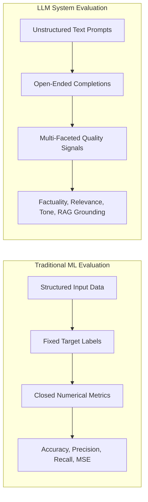
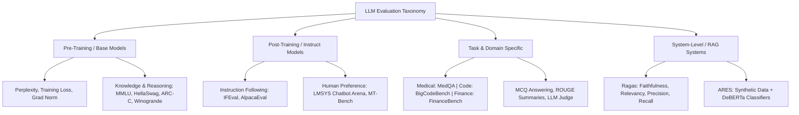
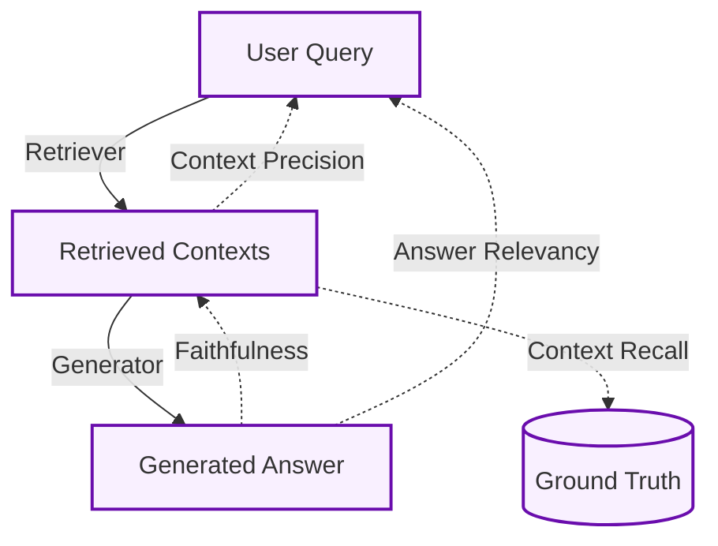
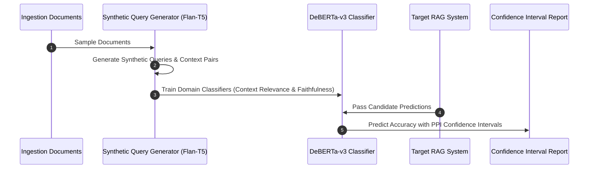
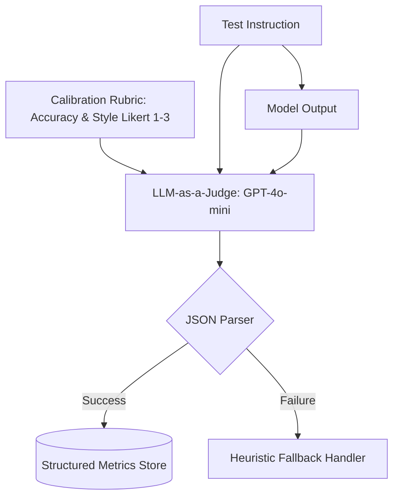
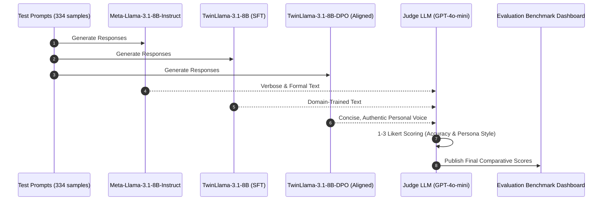

# Chapter 07: Evaluating LLMs & RAG Systems

This chapter covers the complete evaluation lifecycle for production Large Language Model systems: contrasting classic ML metrics with generative NLP evaluation, benchmarking general-purpose vs. task-specific LLMs, evaluating multi-stage RAG architectures with **Ragas** and **ARES**, and implementing an **LLM-as-a-Judge** framework to evaluate **TwinLlama-3.1-8B** across Accuracy and Persona Style.

---

## 📑 Table of Contents

- [1. ML vs. LLM Evaluation Paradigms](#1-ml-vs-llm-evaluation-paradigms)
- [2. Evaluation Taxonomy & Benchmarking Landscape](#2-evaluation-taxonomy--benchmarking-landscape)
  - [General-Purpose Benchmarks](#general-purpose-benchmarks)
  - [Domain & Task-Specific Evaluations](#domain--task-specific-evaluations)
- [3. RAG System Evaluation Frameworks](#3-rag-system-evaluation-frameworks)
  - [The Ragas Triad & Core Metrics](#the-ragas-triad--core-metrics)
  - [ARES: Automated Classifier-Based Evaluation](#ares-automated-classifier-based-evaluation)
- [4. The LLM-as-a-Judge Pattern](#4-the-llm-as-a-judge-pattern)
  - [Scoring Mechanisms & Likert Calibration](#scoring-mechanisms--likert-calibration)
  - [Systemic Judge Biases & Mitigations](#systemic-judge-biases--mitigations)
- [5. Empirical Case Study: Benchmarking TwinLlama-3.1-8B](#5-empirical-case-study-benchmarking-twinllama-31-8b)
  - [Experimental Design (Base vs. SFT vs. DPO)](#experimental-design-base-vs-sft-vs-dpo)
  - [Results & Trade-Off Analysis](#results--trade-off-analysis)
- [6. Directory Layout & Verification](#6-directory-layout--verification)

---

## 1. ML vs. LLM Evaluation Paradigms

Traditional Machine Learning evaluation operates over narrowly scoped statistical tasks (classification, regression) using fixed ground-truth test labels. Generative LLMs operate across subjective, open-ended linguistic outputs requiring multi-dimensional evaluation:



| Dimension | Traditional Machine Learning | Large Language Models |
|---|---|---|
| **Metrics** | Deterministic, scalar ($\text{F1}$, $\text{ROC-AUC}$, $\text{MSE}$) | Probabilistic, multi-faceted ($\text{Perplexity}$, $\text{MMLU}$, $\text{Likert}$) |
| **Feature Layer** | Manual feature engineering validation | End-to-end token representations |
| **Ground Truth** | Objective, immutable ground-truth targets | Subjective, multiple semantically valid completions |
| **Interpretability** | Feature importance (SHAP, weights) | Post-hoc reasoning traces & Judge chain-of-thought |

---

## 2. Evaluation Taxonomy & Benchmarking Landscape



### General-Purpose Benchmarks
* **MMLU (Massive Multitask Language Understanding):** Tests knowledge breadth across 57 subjects (elementary to professional level).
* **HellaSwag / ARC-C:** Tests common-sense reasoning and multi-step causal deduction.
* **IFEval:** Tests hard constraint adherence (e.g., character restrictions, specific output formatting, no commas).
* **Chatbot Arena / MT-Bench:** Evaluates multi-turn dialogue flow and human pairwise preference ratings.

---

## 3. RAG System Evaluation Frameworks

Evaluating a RAG system requires isolating **retriever efficacy** from **generator hallucination**.

### The Ragas Triad & Core Metrics
Ragas formalizes Metrics-Driven Development (MDD) across four fundamental interactions:



1. **Faithfulness:** Verifies factual consistency by extracting atomic claims from the generated answer and checking if each claim is entailed by the retrieved context:
   $$\text{Faithfulness} = \frac{\vert{}\text{Context-Verifiable Claims}\vert{}}{\vert{}\text{Total Claims in Answer}\vert{}}$$
2. **Answer Relevancy:** Measures how directly the response addresses the prompt by generating reverse queries from the answer and calculating mean cosine similarity against the original query.
3. **Context Precision:** Evaluates ranking quality by measuring whether relevant context chunks appear at top positions in the retrieved payload.
4. **Context Recall:** Computes the percentage of ground-truth reference claims covered by the retrieved contexts.

### ARES: Automated Classifier-Based Evaluation
Unlike pure LLM-prompted evaluation, ARES leverages fine-tuned discriminators:



---

## 4. The LLM-as-a-Judge Pattern

When tasks are open-ended or lack scalar ground truths, an advanced LLM (e.g., GPT-4o-mini) acts as an automated judge evaluating responses against explicit rubrics.



### Systemic Judge Biases & Mitigations
* **Position Bias:** Tendency to favor option $A$ in pairwise evaluations $\to$ *Randomize candidate ordering*.
* **Length Bias:** Overrating verbose or flowery answers $\to$ *Implement length penalty and enforce conciseness rubrics*.
* **Family Bias:** Favoring outputs from the judge's own architecture lineage $\to$ *Deploy multi-model juries combining distinct model weights*.

---

## 5. Empirical Case Study: Benchmarking TwinLlama-3.1-8B

To validate style alignment and knowledge retention, three model variants were evaluated across 334 test prompts:
1. `meta-llama/Meta-Llama-3.1-8B-Instruct` (Commercial baseline)
2. `TwinLlama-3.1-8B` (Post Supervised Fine-Tuning)
3. `TwinLlama-3.1-8B-DPO` (Post Preference Alignment)



### Results & Trade-Off Analysis

```text
Model Evaluation Benchmark Results (Scale 1 to 3):

Accuracy:
  Meta-Llama-3.1-8B-Instruct: 2.62  █████████████████████████▍
  TwinLlama-3.1-8B (SFT):     2.45  ████████████████████████
  TwinLlama-3.1-8B-DPO:       2.46  ████████████████████████▌

Style (Casual, Authentic, Unbloated):
  TwinLlama-3.1-8B-DPO:       2.12  █████████████████████▏
  TwinLlama-3.1-8B (SFT):     2.04  ████████████████████▍
  Meta-Llama-3.1-8B-Instruct: 1.86  ██████████████████▋
```

* **Accuracy Analysis:** The base instruct model scored slightly higher on general factual breadth ($2.62$) due to being exposed to $>10\text{M}$ post-training examples. SFT and DPO maintained strong accuracy ($2.45$ and $2.46$) without degradation.
* **Style Analysis:** `TwinLlama-3.1-8B-DPO` scored highest on persona alignment ($2.12$), eliminating academic verbosity while preserving technical precision.

---

## 6. Directory Layout & Verification

```text
chapter07_evaluation/
├── configs/
│   └── evaluation.yaml        # Rubrics, weights, model targets
├── src/
│   ├── __init__.py
│   ├── models.py              # Pydantic schemas (JudgeVerdict, RagasReport)
│   ├── judge.py               # LLM-as-a-Judge parser & Likert evaluator
│   ├── rag_metrics.py         # Ragas metric computation engine
│   ├── benchmark.py           # Multi-model comparative runner
│   └── run.py                 # Pipeline execution runner
├── requirements.txt
└── README.md
```

Run the evaluation suite:
```bash
python -m chapter07_evaluation.src.run
```
