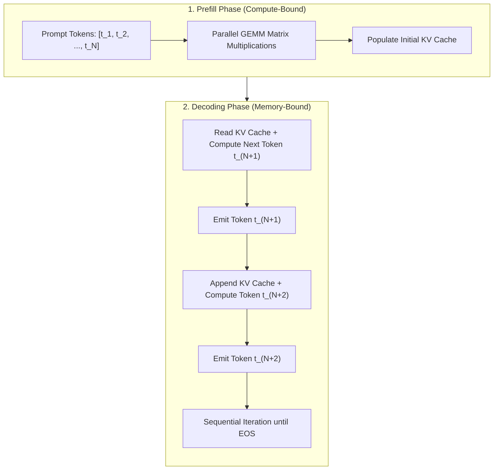
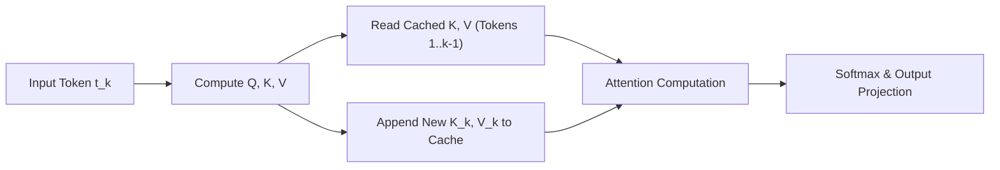
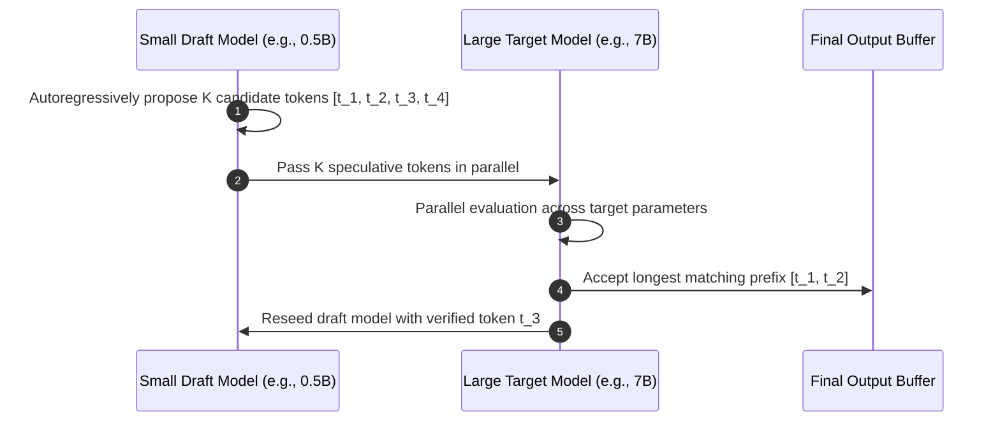
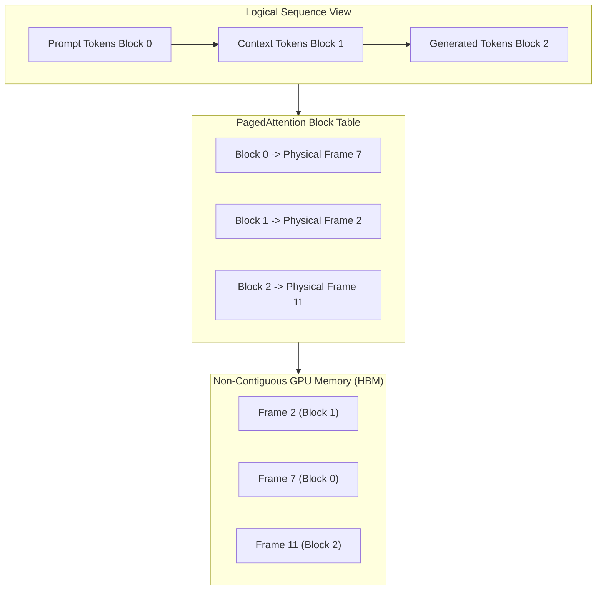
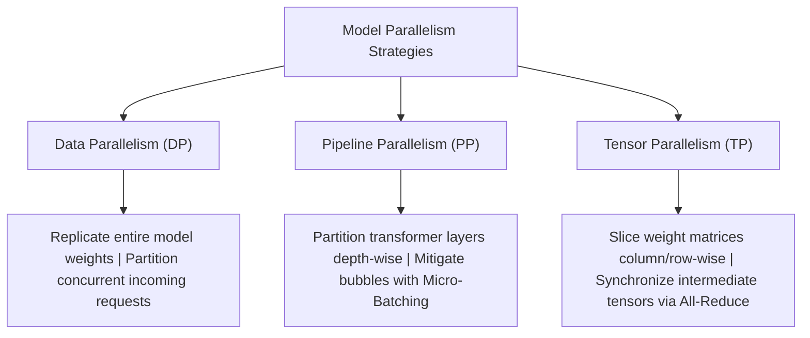

# Chapter 08: High-Throughput LLM Inference Optimization

This chapter covers production-grade inference optimization for Large Language Models. Deploying decoder-only transformer architectures requires overcoming severe memory bandwidth and sequential computational bottlenecks. We examine key techniques: static and dynamic **KV caching**, **continuous batching**, **speculative decoding**, **optimized attention kernels** (FlashAttention-2 & PagedAttention), distributed **model parallelism** (DP, PP, TP), and post-training **weight quantization** (GGUF, GPTQ, EXL2, AWQ).

---

## 📑 Table of Contents

- [1. The Autoregressive Inference Bottleneck](#1-the-autoregressive-inference-bottleneck)
  - [Prefill Phase vs. Decoding Phase](#prefill-phase-vs-decoding-phase)
  - [Memory-Bound vs. Compute-Bound Regimes](#memory-bound-vs-compute-bound-regimes)
- [2. Model Optimization Strategies](#2-model-optimization-strategies)
  - [Key-Value (KV) Caching & Static Memory Compilation](#key-value-kv-caching--static-memory-compilation)
  - [Continuous Batching (In-Flight Batching)](#continuous-batching-in-flight-batching)
  - [Speculative Decoding & Assisted Generation](#speculative-decoding--assisted-generation)
  - [Kernel Optimizations: FlashAttention-2 & PagedAttention](#kernel-optimizations-flashattention-2--pagedattention)
- [3. Distributed Model Parallelism](#3-distributed-model-parallelism)
  - [Data Parallelism (DP)](#data-parallelism-dp)
  - [Pipeline Parallelism (PP) & Micro-Batching](#pipeline-parallelism-pp--micro-batching)
  - [Tensor Parallelism (TP) & Sequence Parallelism](#tensor-parallelism-tp--sequence-parallelism)
  - [Orthogonal Parallelism Fusion](#orthogonal-parallelism-fusion)
- [4. Model Quantization Landscape](#4-model-quantization-landscape)
  - [Numerical Data Types: FP32, FP16, BF16](#numerical-data-types-fp32-fp16-bf16)
  - [Linear Quantization: Absmax & Zero-Point](#linear-quantization-absmax--zero-point)
  - [Mixed Precision & Outlier Features (LLM.int8())](#mixed-precision--outlier-features-llmint8)
  - [GPU & CPU Formats: GGUF, GPTQ, EXL2, AWQ](#gpu--cpu-formats-gguf-gptq-exl2-awq)
- [5. Serving Engines Feature Matrix](#5-serving-engines-feature-matrix)
- [6. Implementation & Benchmarking](#6-implementation--benchmarking)
- [7. Directory Layout & Verification](#7-directory-layout--verification)

---

## 1. The Autoregressive Inference Bottleneck

Decoder-only architectures generate tokens autoregressively. Each forward pass depends on the outputs of all preceding iterations:



### Prefill Phase vs. Decoding Phase
1. **Prefill (Prompt Processing):** The model ingests all input tokens concurrently. This phase is **compute-bound** and fully saturates Tensor Cores via dense Matrix Multiplications (GEMM).
2. **Decoding (Token Generation):** Generation proceeds one token at a time. This phase is **memory bandwidth-bound**, spending most execution cycles transferring weights and KV vectors from GPU High Bandwidth Memory (HBM) to on-chip SRAM.

---

## 2. Model Optimization Strategies

### Key-Value (KV) Caching & Static Memory Compilation
Without caching, predicting token $t_k$ requires recomputing the self-attention projections for all prior $t_1, \dots, t_{k-1}$ tokens ($\mathcal{O}(k^2)$ complexity). The KV cache persists key and value representations across generation cycles ($\mathcal{O}(1)$ step complexity).



The memory footprint of a standard KV cache scales linearly with sequence length:
$$\text{Size}(\text{KV Cache}) = 2 \cdot n_{\text{tokens}} \cdot n_{\text{layers}} \cdot n_{\text{heads}} \cdot d_{\text{head}} \cdot n_{\text{bytes}}$$

* **Static KV Cache:** Dynamic memory reallocation forces kernel re-compilation. Pre-allocating a static buffer allows runtime integration with `torch.compile(mode="reduce-overhead")`, yielding up to a 4x forward-pass acceleration.

---

### Continuous Batching (In-Flight Batching)
Standard batching stalls available GPU capacity waiting for the longest response (the "straggler") to reach completion. **Continuous batching** evicts completed sequences and schedules newly arriving queries dynamically at token boundaries:

```mermaid
gantt
    title Traditional Batching vs Continuous Batching
    dateFormat X
    axisFormat %s

    section Traditional Batching
    Request 1 (Short)       :a1, 0, 3
    Request 2 (Long)        :a2, 0, 8
    GPU Idle Time on Req 1  :crit, 3, 8

    section Continuous Batching
    Request 1 (Short)       :b1, 0, 3
    Request 3 (Inserted)    :active, b2, 3, 7
    Request 2 (Long)        :b3, 0, 8
    Request 4 (Inserted)    :active, b4, 7, 10
```



---

### Speculative Decoding & Assisted Generation
Speculative decoding circumvents memory bandwidth saturation by deploying a compact draft model (e.g., 0.5B parameters) to propose candidate tokens in parallel, which are verified simultaneously in a single forward pass by the primary foundation model (e.g., 7B+ parameters):



$$\text{Effective Speedup} \approx \frac{1 - (1 - \alpha)^{K+1}}{\alpha}$$
Where $\alpha$ is the draft acceptance rate and $K$ is the speculative lookahead window.

---

### Kernel Optimizations: FlashAttention-2 & PagedAttention
* **FlashAttention-2:** Tiles attention matrices across on-chip GPU SRAM, computing online softmax incrementally to avoid storing quadratic attention matrices in high-bandwidth memory.
* **PagedAttention:** Resolves internal and external memory fragmentation by partitioning the KV cache into discrete, non-contiguous physical memory blocks analogous to OS virtual memory pages.



---

## 3. Distributed Model Parallelism

When model parameter volume exceeds single-accelerator capacity or when low serving latencies are required, model weights and compute partitions are distributed across GPU topologies:



### Tensor Parallelism Matrix Decomposition
In self-attention and MLP blocks, large linear layers are partitioned across devices. For an MLP layer $Y = \text{GeLU}(X \cdot W_1) \cdot W_2$:
1. $W_1$ is split **column-wise**: each GPU holds $W_1^{(i)}$ and computes $H_i = \text{GeLU}(X \cdot W_1^{(i)})$ with no communication.
2. $W_2$ is split **row-wise**: each GPU computes $Y_i = H_i \cdot W_2^{(i)}$.
3. A single collective **All-Reduce** sum operation unifies $Y = \sum_i Y_i$.

---

## 4. Model Quantization Landscape

### Numerical Data Types: FP32, FP16, BF16
Deep learning models map weights across IEEE floating-point standards:
* **FP32:** 1 sign bit, 8 exponent bits, 23 mantissa bits (Full precision baseline).
* **FP16:** 1 sign bit, 5 exponent bits, 10 mantissa bits (Limited dynamic range, prone to underflow).
* **BF16:** 1 sign bit, 8 exponent bits, 7 mantissa bits (Preserves FP32 dynamic range, standard for modern training and serving).

### Linear Quantization: Absmax & Zero-Point
Quantization compresses floating-point weights into 8-bit or 4-bit integers:

$$\text{Absmax (Symmetric)}: \quad X_{\text{quant}} = \text{round}\left( 127 \cdot \frac{X}{\max \vert{}X\vert{}} \right), \quad X_{\text{dequant}} = \frac{\max \vert{}X\vert{}}{127} \cdot X_{\text{quant}}$$

$$\text{Zero-Point (Asymmetric)}: \quad \text{scale} = \frac{255}{\max(X) - \min(X)}, \quad \text{zeropoint} = -\text{round}(\text{scale} \cdot \min(X)) - 128$$

### Mixed Precision & Outlier Features (LLM.int8())
Approximately 0.1% of transformer hidden dimensions contain extreme outlier activation values that degrade standard integer quantization. **LLM.int8()** dynamically isolates outlier columns into an FP16 matrix multiplication while quantizing the remaining 99.9% of weights to INT8.

### GPU & CPU Formats: GGUF, GPTQ, EXL2, AWQ
* **GGUF (llama.cpp):** Unified format optimized for CPU computation with dynamic GPU layer offloading (supports k-quants like `Q4_K_M` and i-quants).
* **GPTQ:** Second-order error minimization via Cholesky decomposition of the inverse Hessian matrix; ideal for 4-bit GPU serving.
* **EXL2 (ExLlamaV2):** Variable fractional bitrates (e.g., 2.2 to 6.0 bits/weight) optimizing mixed precision per layer for single-GPU serving.
* **AWQ:** Activation-aware weight quantization that protects salient channels based on activation magnitudes without backpropagation.

---

## 5. Serving Engines Feature Matrix

| Feature / Capability | TGI (Hugging Face) | vLLM (Berkeley) | TensorRT-LLM (NVIDIA) |
|---|---|---|---|
| **Continuous / In-Flight Batching** | Yes | Yes | Yes |
| **PagedAttention Engine** | Yes | Yes (Native) | Yes |
| **FlashAttention-2** | Yes | Yes | Yes |
| **Speculative Decoding** | Yes | Yes | Yes |
| **Tensor Parallelism (TP)** | Yes | Yes | Yes |
| **Pipeline Parallelism (PP)** | No | Limited | Yes (Advanced) |
| **Quantization Support** | AWQ, GPTQ, BitsAndBytes | AWQ, GPTQ, FP8, SqueezeLLM | AWQ, GPTQ, FP8, SmoothQuant |
| **Primary Target Environment** | Cloud Kubernetes / Docker | High-Throughput Production Serving | Enterprise NVIDIA Clusters (DGX / H100) |

---

## 6. Implementation & Benchmarking

```bash
python -m chapter08_inference_optimization.src.run
```

---

## 7. Directory Layout & Verification

```text
chapter08_inference_optimization/
├── configs/
│   └── inference.yaml         # Engine parameters, quantization specs, and cache sizes
├── src/
│   ├── __init__.py
│   ├── kv_cache.py            # Static/Dynamic KV Cache sizing & compilation simulator
│   ├── batching.py            # Continuous batching queue scheduler
│   ├── speculative.py         # Speculative decoding validation & speedup engine
│   ├── quantization.py        # Absmax, Zero-point & LLM.int8() numeric algorithms
│   └── run.py                 # Benchmarking orchestrator
├── requirements.txt
└── README.md
```
