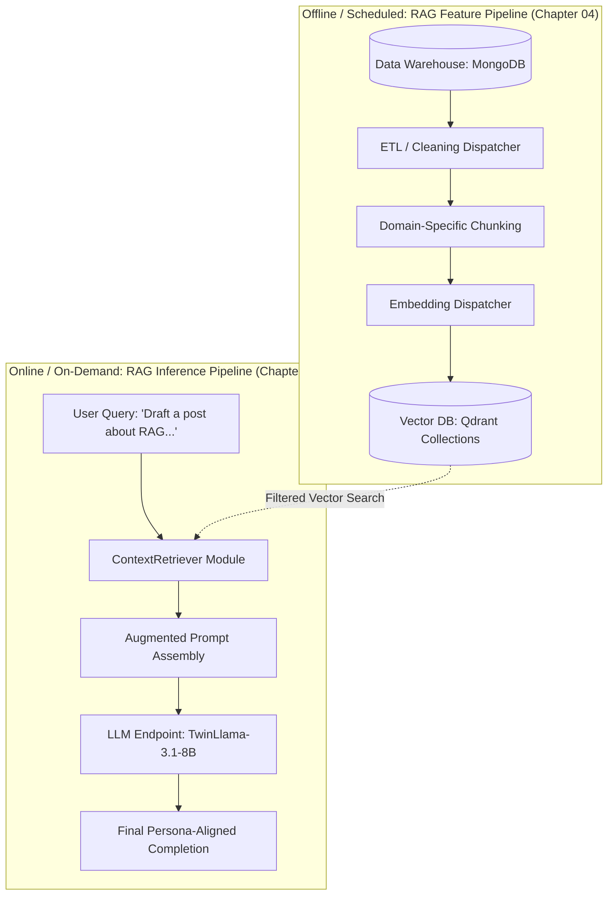
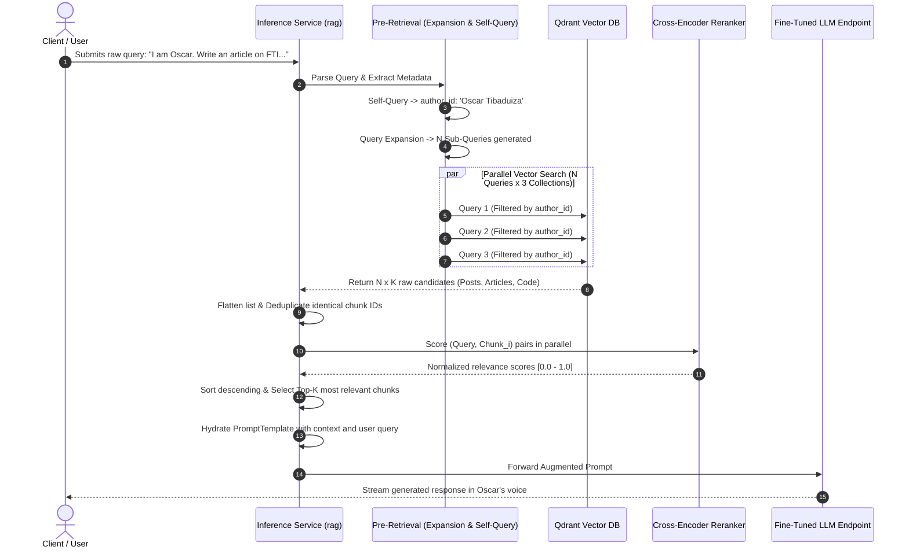
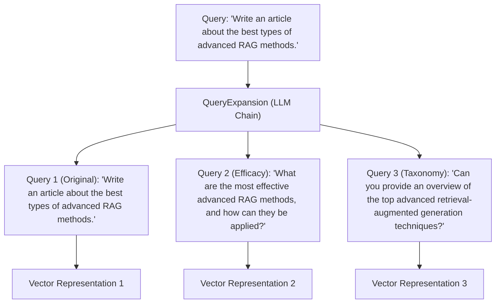
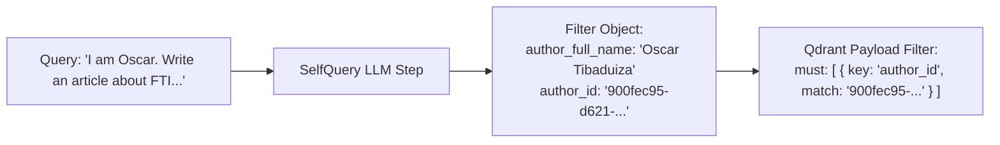
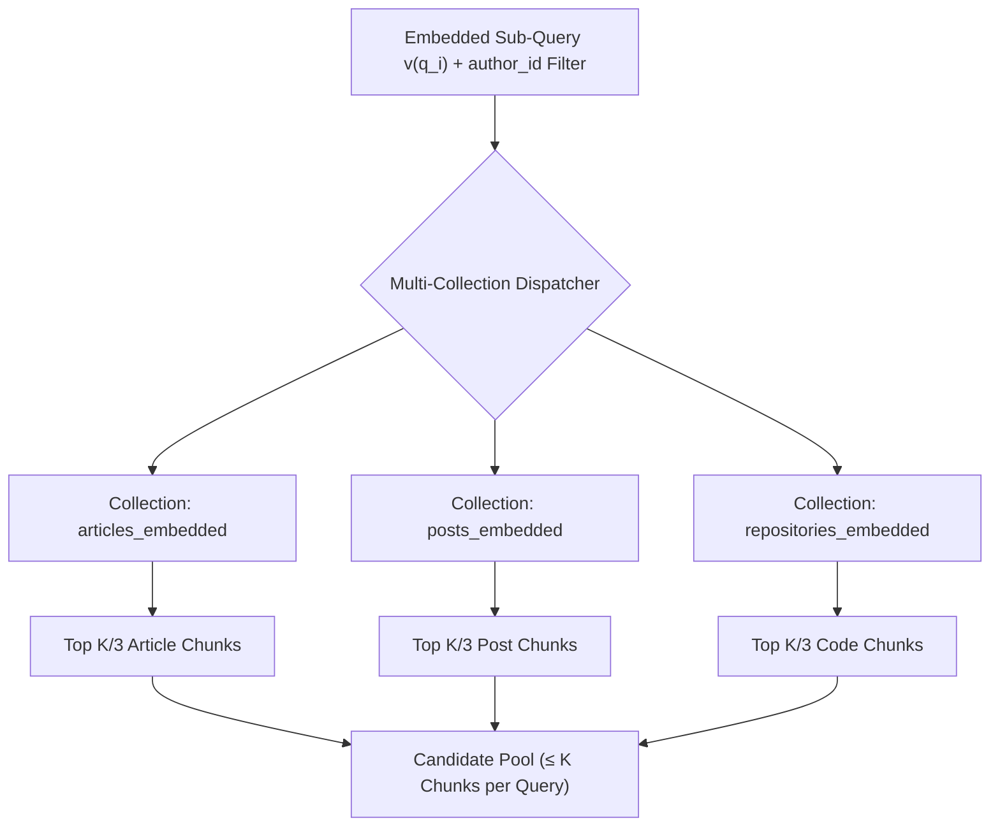
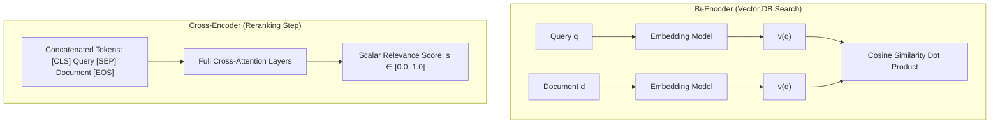
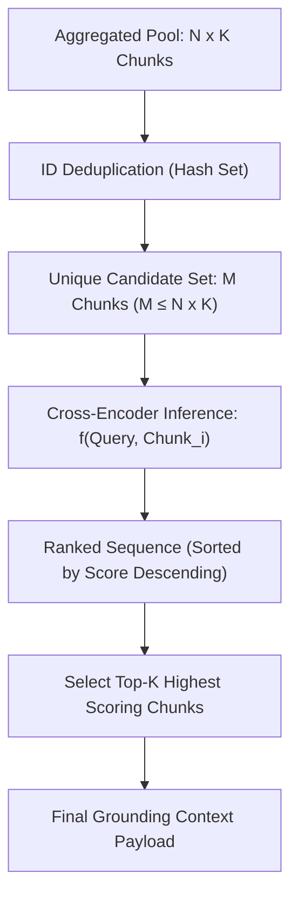
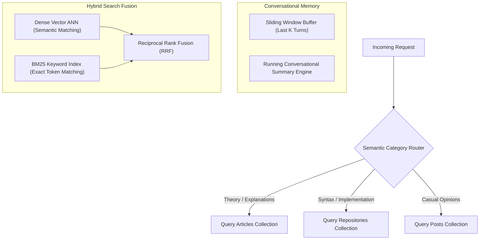

# Chapter 09: RAG Inference Pipeline & Advanced Retrieval

This chapter implements the production **RAG Inference Pipeline** for the LLM Twin system. While Chapter 04 established the asynchronous, batch feature ingestion pipeline to populate the vector store, this chapter develops the real-time, low-latency serving pipeline responsible for resolving user queries, executing advanced pre-retrieval query transformations, performing filtered multi-collection searches in Qdrant, reranking candidates with neural cross-encoders, and generating completions conditioned on factual context.

---

## 📑 Table of Contents

- [1. System Architecture: Decoupled Serving Flow](#1-system-architecture-decoupled-serving-flow)
  - [Feature Pipeline vs. Inference Pipeline](#feature-pipeline-vs-inference-pipeline)
  - [End-to-End Inference Lifecycle](#end-to-end-inference-lifecycle)
- [2. Advanced Pre-Retrieval Optimization](#2-advanced-pre-retrieval-optimization)
  - [Query Expansion (Multi-Query Generation)](#query-expansion-multi-query-generation)
  - [Self-Querying (Metadata Extraction & Slot Filling)](#self-querying-metadata-extraction--slot-filling)
- [3. Retrieval Optimization: Filtered Vector Search](#3-retrieval-optimization-filtered-vector-search)
  - [Fan-Out Multi-Collection Partitioning](#fan-out-multi-collection-partitioning)
  - [Eliminating Vector Space Ambiguity](#eliminating-vector-space-ambiguity)
- [4. Post-Retrieval Optimization: Neural Cross-Encoder Reranking](#4-post-retrieval-optimization-neural-cross-encoder-reranking)
  - [Bi-Encoder vs. Cross-Encoder Mechanics](#bi-encoder-vs-cross-encoder-mechanics)
  - [Deduplication & Top-K Truncation](#deduplication--top-k-truncation)
- [5. Prompt Augmentation & Generation Pipeline](#5-prompt-augmentation--generation-pipeline)
- [6. Architectural Extensions for Production RAG](#6-architectural-extensions-for-production-rag)
  - [Query Routing](#query-routing)
  - [Conversational Memory Management](#conversational-memory-management)
  - [Hybrid Search: Dense Vectors + BM25 Fusion](#hybrid-search-dense-vectors--bm25-fusion)
- [7. Directory Layout & Verification](#7-directory-layout--verification)

---

## 1. System Architecture: Decoupled Serving Flow

### Feature Pipeline vs. Inference Pipeline

A common architectural antipattern is tightly coupling feature processing with inference serving. In the LLM Twin, these workloads are separated across independent infrastructure nodes:



* **Feature Pipeline:** Operates asynchronously in batch mode to maintain feature freshness.
* **Inference Pipeline:** Executes synchronously on demand per incoming HTTP request with strict latency budgets.

---

### End-to-End Inference Lifecycle

The complete path of a query through the retrieval engine into the generation service follows an eight-stage progression:



---

## 2. Advanced Pre-Retrieval Optimization

Single vector queries suffer from representational bottlenecks: a single dense vector cannot capture all semantic facets of a compound question, nor can it enforce strict categorical metadata constraints.

### Query Expansion (Multi-Query Generation)

To prevent vector distance search from missing relevant context residing in nearby topological regions of the embedding space, the original query $q$ is expanded into $N$ diverse perspectives using a zero-shot multi-query prompt:



$$\text{Embedding Space Coverage: } \bigcup_{i=1}^N \mathcal{B}(v(q_i), \epsilon) \gg \mathcal{B}(v(q), \epsilon)$$

---

### Self-Querying (Metadata Extraction & Slot Filling)

Dense embeddings compress semantic meaning but fail to guarantee strict entity matching (e.g., author names, repository IDs, creation dates). **Self-querying** leverages an LLM to parse unstructured queries into structured query metadata filters prior to execution:



---

## 3. Retrieval Optimization: Filtered Vector Search

### Fan-Out Multi-Collection Partitioning

To maintain balanced context representation across all content types produced by the author, the retrieval engine distributes searches across three distinct collections: `articles`, `posts`, and `repositories`:



$$\text{Total Raw Candidates Retrieved} = \sum_{i=1}^N \sum_{c \in \text{Collections}} \left\lfloor \frac{K}{\vert{}\text{Collections}\vert{}} \right\rfloor \le N \times K$$

### Eliminating Vector Space Ambiguity

Without payload filtering, queries like *"Java memory models"* risk returning results about both the programming language and the geographic region. Metadata filtering restricts vector comparison exclusively to the valid search partition, reducing search space and query latency:

$$\text{Latency Reduction: } \mathcal{O}(\vert{}\text{Filtered Partition}\vert{} \cdot d) \ll \mathcal{O}(\vert{}\text{Entire Corpus}\vert{} \cdot d)$$

---

## 4. Post-Retrieval Optimization: Neural Cross-Encoder Reranking

### Bi-Encoder vs. Cross-Encoder Mechanics

The vector database uses a **bi-encoder** architecture (generating separate embeddings for query and document, comparing via cosine dot products). While fast ($\mathcal{O}(1)$ with ANN indices), bi-encoders lose cross-attention word-level interaction.

The post-retrieval stage applies a **neural cross-encoder** (`cross-encoder/ms-marco-MiniLM-L-4-v2`) that evaluates the query and chunk tokens concurrently in self-attention:



---

### Deduplication & Top-K Truncation

Because expanded queries often retrieve overlapping document segments, the system deduplicates records by their deterministic `chunk_id` before reranking:



---

## 5. Prompt Augmentation & Generation Pipeline

Once the top $K$ chunks are selected, they are formatted into the grounding block of the prompt template:

```text
You are a content creator. Write what the user asked you to while using 
the provided context as the primary source of information for the content.

User query: {query}

Context:
--- Reference 1 (articles) ---
Decoupled machine learning systems isolate Feature, Training, and Inference pipelines...
--- Reference 2 (code) ---
class VectorBaseDocument:
    def bulk_insert(self, docs): ...
```

---

## 6. Architectural Extensions for Production RAG

To scale the system beyond the baseline, three architectural enhancements can be added:



1. **Semantic Category Router:** Classifies query intent using a lightweight model to avoid searching all three collections when only one is relevant.
2. **Conversational Memory Management:** Combines a rolling summary of older turns with a verbatim sliding window buffer of the last $K$ exchanges.
3. **Hybrid Search Fusion (Dense + BM25):** Merges vector distance rankings with keyword exact-match scores using Reciprocal Rank Fusion:
   $$\text{RRF Score}(d) = \sum_{m \in \{\text{Dense}, \text{BM25}\}} \frac{1}{60 + \text{rank}_m(d)}$$

---

## 7. Directory Layout & Verification

```text
chapter09_rag_inference_pipeline/
├── configs/
│   └── rag_inference.yaml       # Retrieval hyperparameters, models, top-k limits
├── src/
│   ├── domain/
│   │   ├── __init__.py
│   │   └── queries.py           # Query and EmbeddedQuery OVM entities
│   ├── rag/
│   │   ├── __init__.py
│   │   ├── base.py              # Abstract interfaces (RAGStep, PromptTemplateFactory)
│   │   ├── prompt_templates.py  # QueryExpansion, SelfQuery, and RAG prompt templates
│   │   ├── query_expansion.py   # Multi-query expansion engine
│   │   ├── self_query.py        # Metadata slot extractor
│   │   ├── reranking.py         # Cross-Encoder neural reranker (Singleton)
│   │   ├── retriever.py         # ContextRetriever coordinator
│   │   └── llm_client.py        # Sagemaker endpoint & local LLM executor
│   ├── settings.py              # Pydantic Settings configuration
│   └── run.py                   # Chapter execution runner
├── requirements.txt
└── README.md
```

Execute the RAG inference pipeline:
```bash
python -m chapter09_rag_inference_pipeline.src.run
```
