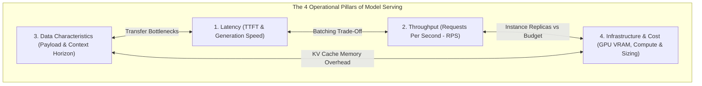
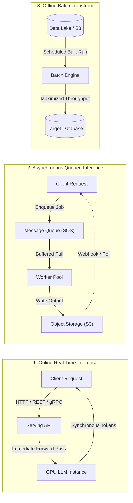
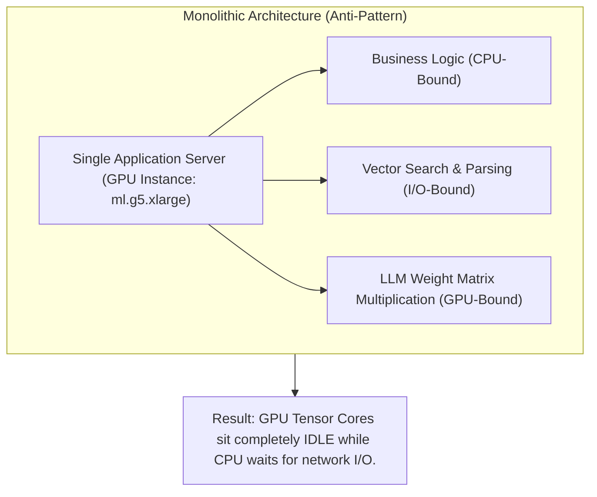
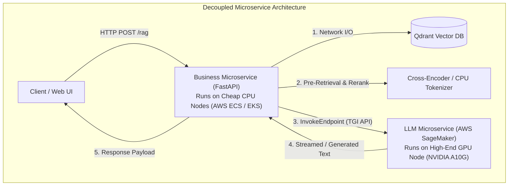
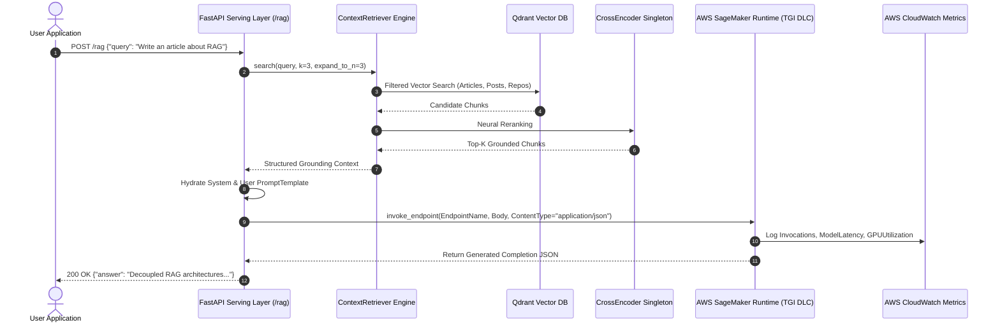
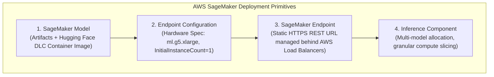
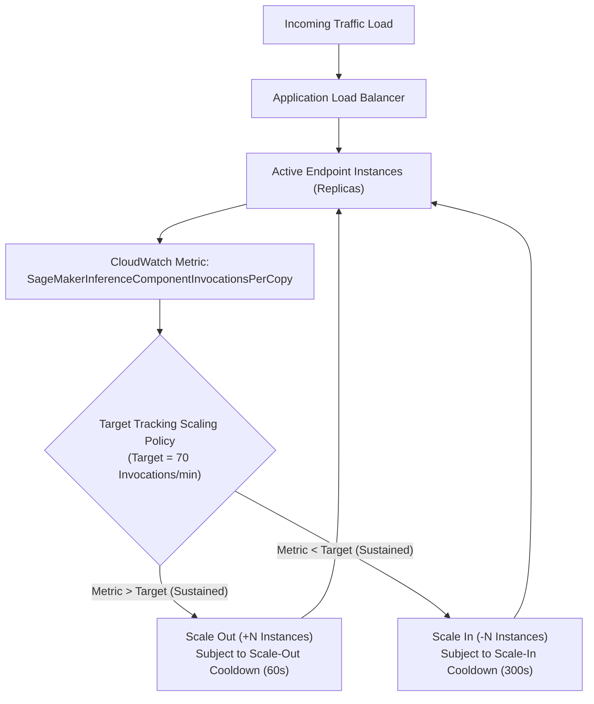

# Chapter 10: Production Inference Pipeline Deployment

This chapter covers the production deployment of the **LLM Twin Inference Pipeline**. We examine the operational trade-offs across model-serving paradigms, compare monolithic versus microservice architectures, deploy the fine-tuned `TwinLlama-3.1-8B-DPO` model onto **AWS SageMaker Real-Time Endpoints** leveraging **Hugging Face Deep Learning Containers (TGI)**, build an asynchronous **FastAPI** business serving layer, and configure **Application Auto Scaling** policies based on invocation loads.

---

## 📑 Table of Contents

- [1. The Four Operational Pillars of Model Serving](#1-the-four-operational-pillars-of-model-serving)
- [2. Taxonomy of Inference Deployment Paradigms](#2-taxonomy-of-inference-deployment-paradigms)
  - [Online Real-Time Inference](#online-real-time-inference)
  - [Asynchronous Queued Inference](#asynchronous-queued-inference)
  - [Offline Batch Transform](#offline-batch-transform)
- [3. Architecture Strategy: Monolith vs. Microservices](#3-architecture-strategy-monolith-vs-microservices)
  - [The Compute Inefficiency of Monolith Serving](#the-compute-inefficiency-of-monolith-serving)
  - [Decoupled Microservice Serving](#decoupled-microservice-serving)
- [4. The LLM Twin Production Deployment Architecture](#4-the-llm-twin-production-deployment-architecture)
  - [The Serving Lifecycle Flow](#the-serving-lifecycle-flow)
  - [AWS SageMaker Infrastructure Topology](#aws-sagemaker-infrastructure-topology)
  - [Hugging Face Deep Learning Containers (DLC & TGI)](#hugging-face-deep-learning-containers-dlc--tgi)
- [5. Autoscaling and Elastic Fleet Management](#5-autoscaling-and-elastic-fleet-management)
  - [Target Tracking Scaling Policies](#target-tracking-scaling-policies)
  - [Cooldown Windows & Over-Scaling Protection](#cooldown-windows--over-scaling-protection)
- [6. Directory Layout & Verification](#6-directory-layout--verification)

---

## 1. The Four Operational Pillars of Model Serving

Every machine learning serving architecture is bounded by trade-offs among four interdependent engineering vectors:



* **Latency (End-to-End & TTFT):** Crucial for conversational interactivity ($< 2.5\text{ s}$). The total latency is formulated as:
  $$\text{Latency}_{\text{total}} = \text{Latency}_{\text{net}} + \text{Latency}_{\text{serdes}} + \text{Latency}_{\text{prefill}} + (N_{\text{tokens}} \cdot \text{Latency}_{\text{decode}})$$
* **Throughput (RPS):** The aggregate volume of queries completed per unit time. Large batching amortizes memory transfers of model weights, maximizing throughput at the expense of per-query latency.
* **Data Characteristics:** Unstructured text inputs with large prompt horizons ($> 4\text{k tokens}$) require extensive VRAM buffers for KV caching.
* **Infrastructure & Compute Cost:** High-end accelerators ($\text{NVIDIA A10G / A100}$) are expensive. Maximizing utilization and minimizing idle compute determines production viability.

---

## 2. Taxonomy of Inference Deployment Paradigms

Depending on user expectations, batch tolerance, and hardware budgets, model serving is structured into three fundamental operational patterns:



| Deployment Pattern | Latency Profile | Throughput Profile | Cost Efficiency | Primary Use Cases |
|---|---|---|---|---|
| **Online Real-Time** | Sub-second ($100\text{ ms} - 2\text{ s}$) | Moderate (Limited by concurrency) | Expensive (Idle GPU overhead) | Chatbots, interactive RAG, code autocomplete |
| **Asynchronous** | Minutes ($5\text{ s} - 10\text{ min}$) | High (Decoupled smoothing) | Balanced (Buffers traffic spikes) | Video deepfakes, long document synthesis |
| **Offline Batch** | Hours / Overnight | Maximized (Fully saturated) | Lowest cost per token | Periodic reporting, dataset annotation, bulk embedding |

---

## 3. Architecture Strategy: Monolith vs. Microservices

### The Compute Inefficiency of Monolith Serving

Bundling business logic, vector search, prompt templates, and the LLM engine inside a single server creates severe resource contention:



### Decoupled Microservice Serving

Separating the business serving layer from the LLM execution environment isolates hardware requirements:



---

## 4. The LLM Twin Production Deployment Architecture

### The Serving Lifecycle Flow



---

### AWS SageMaker Infrastructure Topology

SageMaker organizes model serving into four distinct, loosely coupled cloud primitives:



* **SageMaker Model:** Links the execution role (`ARN_ROLE`), the inference container URI (`TGI DLC`), and model weights (`mlabonne/TwinLlama-3.1-8B-DPO`).
* **Endpoint Configuration:** Declares compute instances (`ml.g5.xlarge` with 1 NVIDIA A10G 24GB GPU, 4 vCPUs, 16GB RAM) and production variants.
* **SageMaker Endpoint:** Managed, highly available HTTPS entrypoint with automated TLS termination and health probing.
* **Inference Component:** Granular placement abstraction enabling dynamic multi-adapter deployments on shared hardware.

---

### Hugging Face Deep Learning Containers (DLC & TGI)

The endpoint runs Hugging Face's production **Text Generation Inference (TGI)** container, delivering state-of-the-art serving optimizations:
* **Tensor Parallelism:** Slices weight matrices across multiple GPUs when using multi-accelerator nodes (`ml.g5.12xlarge`).
* **Continuous Batching:** Schedules newly arrived queries without waiting for earlier queries to finish.
* **PagedAttention & FlashAttention-2:** Eliminates memory fragmentation and accelerates self-attention kernels.
* **Safetensors Zero-Copy Loading:** Rapid cold-start loading into GPU VRAM.

---

## 5. Autoscaling and Elastic Fleet Management

To prevent paying for idle GPU machines during low-traffic windows while remaining resilient against sudden traffic spikes, SageMaker integrates with **AWS Application Auto Scaling**:



### Target Tracking Scaling Policies
* **Dynamic Target:** Instead of static step rules, the policy maintains an invariant target metric (e.g., target 70 requests per minute per replica).
* **Boundaries:** Explicitly clamped between `MinCapacity = 1` and `MaxCapacity = 4`.

### Cooldown Windows & Over-Scaling Protection
* **Scale-Out Cooldown (e.g., 60 seconds):** Prevents premature creation of multiple redundant servers before a recently added instance has initialized.
* **Scale-In Cooldown (e.g., 300 seconds):** Enforces a conservative grace period before terminating GPU instances to avoid rapid oscillations (thrashing) during bursty traffic.

---

## 6. Directory Layout & Verification

```text
chapter10_inference_deployment/
├── configs/
│   └── deployment.yaml         # AWS SageMaker instance specs & FastAPI settings
├── src/
│   ├── __init__.py
│   ├── settings.py             # Pydantic Settings (IAM credentials, endpoints)
│   ├── api/
│   │   ├── __init__.py
│   │   ├── schemas.py          # QueryRequest & QueryResponse models
│   │   └── server.py           # FastAPI REST API exposing /rag
│   ├── aws/
│   │   ├── __init__.py
│   │   ├── sagemaker_deployer.py # Boto3 automation for Endpoints & Models
│   │   ├── sagemaker_client.py   # Runtime client & InferenceExecutor
│   │   └── autoscaling.py      # Application Auto Scaling target & policy setup
│   └── run.py                  # End-to-end integration and test harness
├── requirements.txt
└── README.md
```

Execute the local integration verification:
```bash
python -m chapter10_inference_deployment.src.run
```
