# Chapter 11: LLMOps, Continuous Training (CT), CI/CD & Observability

This chapter concludes the engineering implementation of the **LLM Twin** system by establishing enterprise-grade **Machine Learning Operations (MLOps)** and **Large Language Model Operations (LLMOps)**. We examine the evolution from classical DevOps to modern LLMOps, build automated **CI/CD** workflows using GitHub Actions, design **Continuous Training (CT)** orchestration pipelines via **ZenML**, implement safety **guardrails**, and deploy full-trace **prompt monitoring and observability** with **Opik (Comet ML)**.

---

## 📑 Table of Contents

- [1. Evolution: From DevOps to MLOps to LLMOps](#1-evolution-from-devops-to-mlops-to-llmops)
  - [DevOps: Code-Centric Automation](#devops-code-centric-automation)
  - [MLOps: The Triad of Code, Data, and Model](#mlops-the-triad-of-code-data-and-model)
  - [LLMOps: Foundation Models, Traces & Non-Determinism](#llmops-foundation-models-traces--non-determinism)
- [2. The 6 Core Principles of MLOps](#2-the-6-core-principles-of-mlops)
- [3. End-to-End Cloud Infrastructure Topology](#3-end-to-end-cloud-infrastructure-topology)
  - [Decoupled Cloud Primitives](#decoupled-cloud-primitives)
  - [Containerization Strategy (Docker & AWS ECR)](#containerization-strategy-docker--aws-ecr)
- [4. CI/CD & Continuous Training (CT) Lifecycle](#4-cicd--continuous-training-ct-lifecycle)
  - [Continuous Integration (Static Analysis & Tests)](#continuous-integration-static-analysis--tests)
  - [Continuous Delivery (Automated Build & ECR Push)](#continuous-delivery-automated-build--ecr-push)
  - [Continuous Training (CT Engine & Dependency Chaining)](#continuous-training-ct-engine--dependency-chaining)
- [5. Input & Output Guardrails Architecture](#5-input--output-guardrails-architecture)
  - [Input Interception (PII Leaks & Jailbreak Defenses)](#input-interception-pii-leaks--jailbreak-defenses)
  - [Output Interception (Toxicity & Hallucination Mitigation)](#output-interception-toxicity--hallucination-mitigation)
- [6. Prompt Monitoring & Distributed Observability (Opik)](#6-prompt-monitoring--distributed-observability-opik)
  - [Generation Latency Telemetry (TTFT, TBT, TPS)](#generation-latency-telemetry-ttft-tbt-tps)
  - [Distributed Traces & Execution Spans](#distributed-traces--execution-spans)
- [7. Automated Alerting & Incident Response](#7-automated-alerting--incident-response)
- [8. Directory Layout & Verification](#8-directory-layout--verification)

---

## 1. Evolution: From DevOps to MLOps to LLMOps

Operational engineering practices have expanded as computational workloads shifted from deterministic software to statistical learning and non-deterministic foundation models:

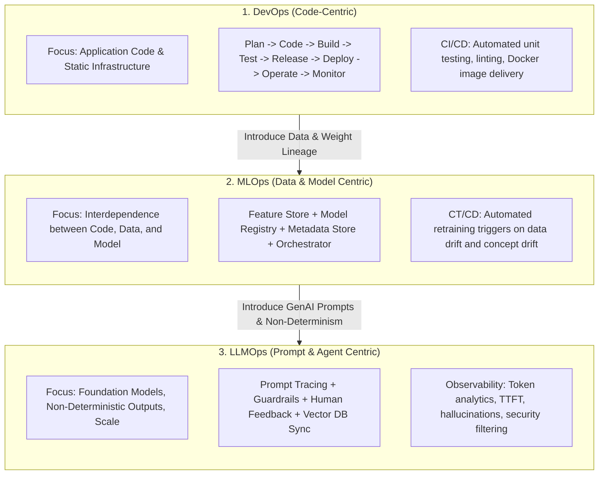

### DevOps: Code-Centric Automation
Standard software systems operate deterministically: identical source code compiled against fixed dependencies produces identical machine binaries. DevOps focuses exclusively on tracking code changes through Version Control (Git) and automating test execution and server deployment.

### MLOps: The Triad of Code, Data, and Model
In machine learning systems, code can remain unmodified while the underlying distribution of real-world data shifts. This drift degrades production accuracy:

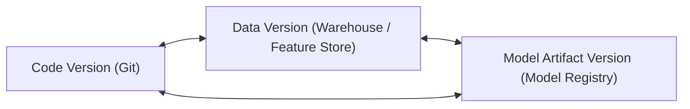

A production release is no longer defined merely by a commit SHA; it represents an immutable tuple:
$$\text{Release Artifact} = \langle \text{Code Version}, \text{Dataset Hash}, \text{Model Weights}, \text{Pipeline Metadata} \rangle$$

### LLMOps: Foundation Models, Traces & Non-Determinism
Because pre-training foundational models from scratch requires hundreds of millions of dollars and specialized supercomputing clusters, enterprise engineering focuses on:
1. **Model Specialization:** Prompt engineering, RAG context injection, and Parameter-Efficient Fine-Tuning (PEFT: LoRA, QLoRA, DPO).
2. **Dynamic Grounding:** Keeping high-dimensional vector representations synchronized with real-world sources via Change Data Capture (CDC).
3. **Execution Observability:** Tracing multi-step pipelines and protecting user interfaces with input/output safety guardrails.

---

## 2. The 6 Core Principles of MLOps

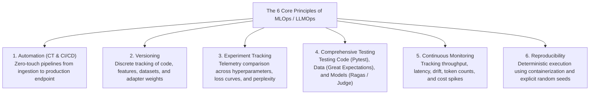

---

## 3. End-to-End Cloud Infrastructure Topology

### Decoupled Cloud Primitives

The complete LLM Twin infrastructure operates across decoupled cloud services, isolating storage, vector similarity, pipeline orchestration, and model serving:

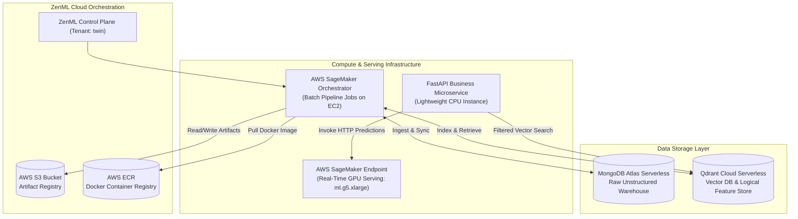

### Containerization Strategy (Docker & AWS ECR)
To guarantee execution parity between local development and cloud jobs, the environment is packaged into a multi-stage Docker container (`Dockerfile`):
* **Base:** `python:3.11-slim-bullseye`.
* **Headless Web Engine:** Pre-installed stable Google Chrome for web scraping.
* **Layer Caching:** Dependency manifests (`pyproject.toml`, `poetry.lock`) are copied and installed prior to copying project source code, maximizing build cache reuse:

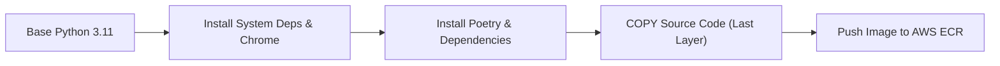

---

## 4. CI/CD & Continuous Training (CT) Lifecycle

### Continuous Integration (CI)
Triggered on every Pull Request to enforce code quality, security checks, and functional correctness before merging:

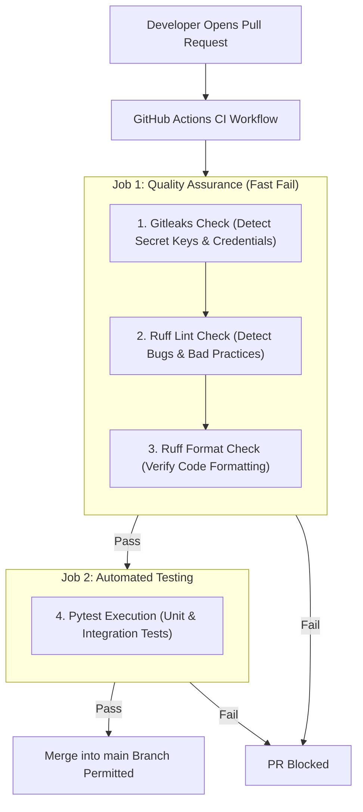

### Continuous Delivery (CD)
Triggered automatically upon merging into the `main` production branch:

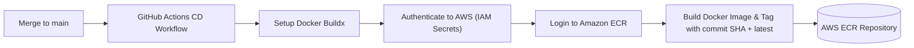

### Continuous Training (CT Engine & Dependency Chaining)
The CT pipeline chains data collection, feature generation, instruction creation, and model training into a unified automated flow:

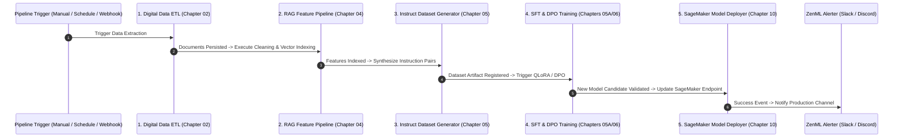

---

## 5. Input & Output Guardrails Architecture

Non-deterministic models require real-time validation layers to intercept malicious inputs and verify generated outputs before delivering responses to users:

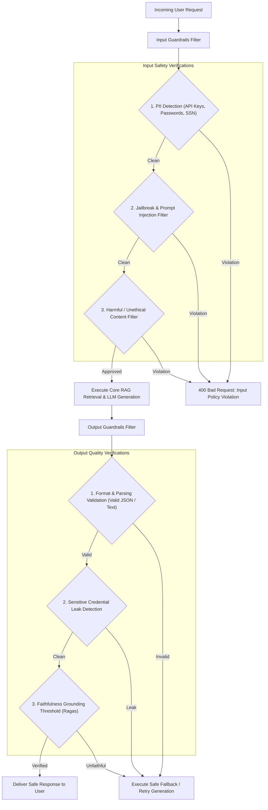

---

## 6. Prompt Monitoring & Distributed Observability (Opik)

### Generation Latency Telemetry
To monitor user experience, inference latency is broken down into constituent metrics:

```mermaid
gantt
    title LLM Inference Latency Decomposition
    dateFormat X
    axisFormat %s

    section Serving Latency
    Network Transmission + Serialization   :done, net, 0, 15
    Context Retrieval & Cross-Encoder      :done, ret, 15, 45
    Time to First Token (TTFT)             :active, ttft, 45, 65
    Token Generation Loop (TBT / TPS)      :crit, gen, 65, 140
```

* **Time to First Token (TTFT):** Duration until the first decoded token is emitted.
* **Time Between Tokens (TBT):** Streaming interval between consecutive output tokens.
* **Tokens Per Second (TPS):** Net generation throughput:
  $$\text{TPS} = \frac{\text{Generated Tokens}}{\text{Generation Duration}}$$
* **Time Per Output Token (TPOT):** Reciprocal of TPS ($\frac{1}{\text{TPS}}$).

### Distributed Traces & Execution Spans

Opik instruments nested hierarchical execution traces, allowing engineers to isolate failures to individual pipeline spans:

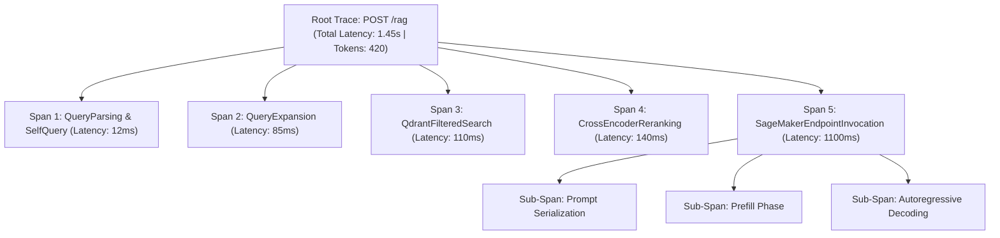

---

## 7. Automated Alerting & Incident Response

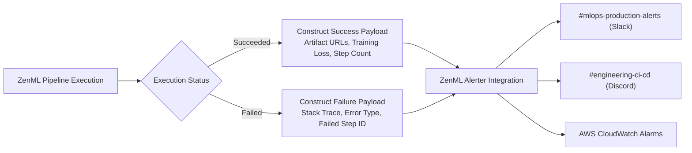

---

## 8. Directory Layout & Verification

```text
chapter11_llmops/
├── configs/
│   └── llmops.yaml             # Cloud stacks, guardrail rules, and alert channels
├── src/
│   ├── __init__.py
│   ├── settings.py             # Credentials and ZenML/Opik settings
│   ├── guardrails/
│   │   ├── __init__.py
│   │   └── safety.py           # Regex PII filtering and prompt injection guards
│   ├── monitoring/
│   │   ├── __init__.py
│   │   └── opik_tracer.py      # Opik full-trace telemetry instrumentation
│   ├── orchestration/
│   │   ├── __init__.py
│   │   ├── alerter.py          # ZenML automated alerting callbacks
│   │   └── pipeline_runner.py  # Continuous Training master pipeline runner
│   └── run.py                  # End-to-end integration and telemetry test harness
├── requirements.txt
└── README.md
```

Execute the LLMOps test harness:
```bash
python -m chapter11_llmops.src.run
```
